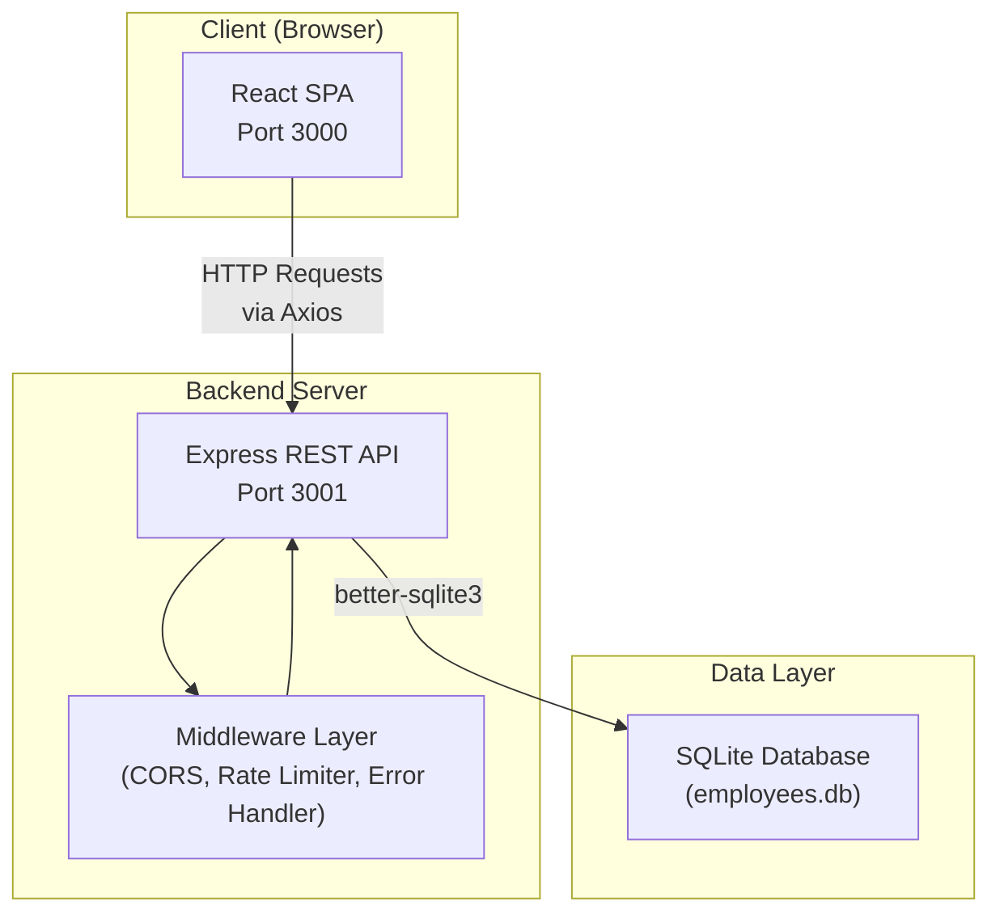
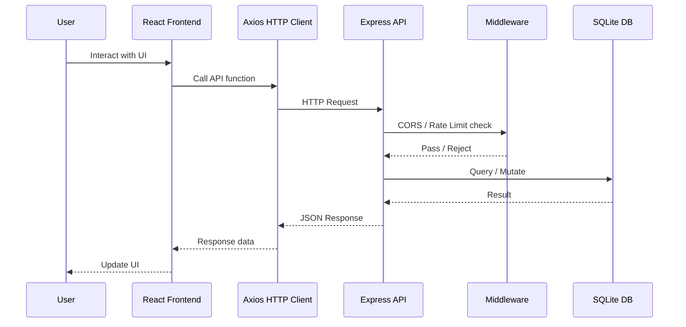
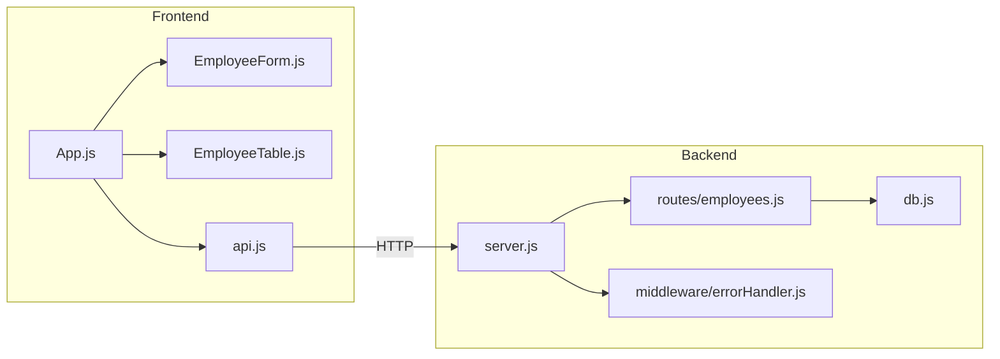
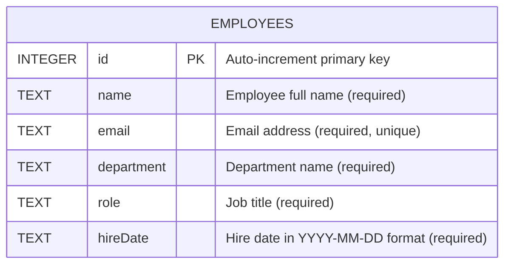
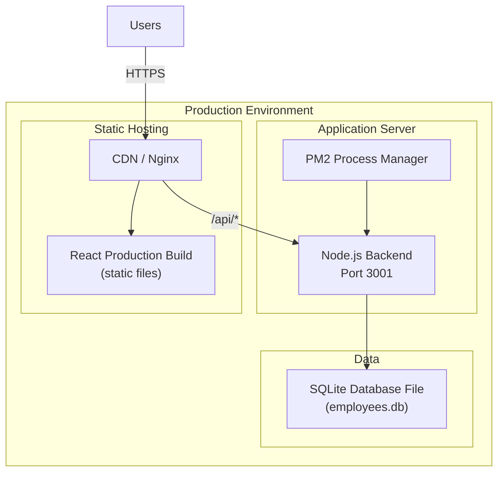

# Technical Design Document: Employee Management System

| Field          | Value                                      |
|----------------|--------------------------------------------|
| **Author**     | Engineering Team                           |
| **Status**     | Proposed                                   |
| **Created**    | 2026-03-13                                 |
| **Last Updated** | 2026-03-13                               |

---

## Table of Contents

1. [Problem Statement](#1-problem-statement)
2. [Proposed Solution](#2-proposed-solution)
3. [System Architecture](#3-system-architecture)
4. [Component Breakdown](#4-component-breakdown)
5. [API Design](#5-api-design)
6. [Data Models](#6-data-models)
7. [Security Considerations](#7-security-considerations)
8. [Performance Requirements](#8-performance-requirements)
9. [Deployment Strategy](#9-deployment-strategy)
10. [Trade-offs and Alternatives Considered](#10-trade-offs-and-alternatives-considered)
11. [Success Metrics](#11-success-metrics)

---

## 1. Problem Statement

Organizations need a centralized system for managing employee records. Current manual or spreadsheet-based approaches lead to:

- **Data inconsistency** across departments with no single source of truth.
- **Slow onboarding** due to manual data entry and lack of validation.
- **Limited visibility** into workforce composition by department or role.
- **No audit trail** for employee data changes.

The goal is to build a web-based Employee Management System that provides reliable CRUD operations for employee records, with a responsive UI and a well-defined REST API.

---

## 2. Proposed Solution

Build a full-stack web application with:

- A **React** single-page application (SPA) for the frontend providing an intuitive interface for managing employees.
- A **Node.js/Express** REST API backend handling business logic and data persistence.
- An **SQLite** embedded database for lightweight, zero-configuration data storage.

The system supports creating, reading, updating, and deleting employee records, with filtering by department and input validation on both client and server.

---

## 3. System Architecture

### 3.1 High-Level Architecture



### 3.2 Request Flow



### 3.3 Component Interaction



---

## 4. Component Breakdown

### 4.1 Frontend Components

| Component | File | Responsibility |
|-----------|------|----------------|
| **App** | `frontend/src/App.js` | Root component. Manages application state (employee list, selected employee, modals). Orchestrates data fetching and CRUD operations via the API client. |
| **EmployeeTable** | `frontend/src/components/EmployeeTable.js` | Renders employees in a sortable, filterable table. Provides department filter dropdown. Emits edit/delete actions to the parent. |
| **EmployeeForm** | `frontend/src/components/EmployeeForm.js` | Modal form for creating and editing employees. Handles input validation (required fields, email format). Supports both add and edit modes. |
| **API Client** | `frontend/src/api.js` | Centralized Axios-based HTTP client. Provides functions for all CRUD operations. Handles base URL configuration. |

### 4.2 Backend Components

| Component | File | Responsibility |
|-----------|------|----------------|
| **Entry Point** | `backend/index.js` | Starts the Express server on the configured port. |
| **Server** | `backend/src/server.js` | Configures Express middleware (CORS, JSON parsing, rate limiting). Mounts API routes. Registers error handler. |
| **Employee Routes** | `backend/src/routes/employees.js` | Defines REST endpoints for employee CRUD. Contains request validation and business logic. |
| **Database Module** | `backend/src/db.js` | Initializes SQLite database. Creates the `employees` table if it does not exist. Exports the database connection. |
| **Error Handler** | `backend/src/middleware/errorHandler.js` | Global Express error-handling middleware. Returns consistent JSON error responses. |

---

## 5. API Design

### 5.1 Base URL

```
http://localhost:3001/api
```

### 5.2 Endpoints

#### List Employees

```
GET /api/employees
```

| Parameter    | In    | Type   | Required | Description                |
|-------------|-------|--------|----------|----------------------------|
| `department` | query | string | No       | Filter by department name  |

**Response** `200 OK`
```json
[
  {
    "id": 1,
    "name": "Jane Doe",
    "email": "jane@example.com",
    "department": "Engineering",
    "role": "Software Engineer",
    "hireDate": "2025-01-15"
  }
]
```

#### Get Employee by ID

```
GET /api/employees/:id
```

**Response** `200 OK` — Single employee object.
**Response** `404 Not Found` — `{ "error": "Employee not found" }`

#### Create Employee

```
POST /api/employees
```

**Request Body**
```json
{
  "name": "Jane Doe",
  "email": "jane@example.com",
  "department": "Engineering",
  "role": "Software Engineer",
  "hireDate": "2025-01-15"
}
```

**Response** `201 Created` — Created employee object with assigned `id`.
**Response** `400 Bad Request` — `{ "error": "All fields are required" }`

#### Update Employee

```
PUT /api/employees/:id
```

**Request Body** — Same schema as Create.
**Response** `200 OK` — Updated employee object.
**Response** `404 Not Found` — `{ "error": "Employee not found" }`

#### Delete Employee

```
DELETE /api/employees/:id
```

**Response** `204 No Content`
**Response** `404 Not Found` — `{ "error": "Employee not found" }`

### 5.3 Error Response Format

All error responses follow a consistent structure:

```json
{
  "error": "Human-readable error message"
}
```

---

## 6. Data Models

### 6.1 Employee Table Schema



### 6.2 SQL Schema

```sql
CREATE TABLE IF NOT EXISTS employees (
    id INTEGER PRIMARY KEY AUTOINCREMENT,
    name TEXT NOT NULL,
    email TEXT NOT NULL UNIQUE,
    department TEXT NOT NULL,
    role TEXT NOT NULL,
    hireDate TEXT NOT NULL
);
```

### 6.3 Supported Department Values

| Department   |
|-------------|
| Engineering |
| Marketing   |
| Sales       |
| HR          |
| Finance     |
| Operations  |

---

## 7. Security Considerations

### 7.1 Current Measures

| Measure | Implementation | Purpose |
|---------|---------------|---------|
| **CORS** | `cors` middleware | Restricts cross-origin requests to allowed origins. |
| **Rate Limiting** | `express-rate-limit` | Prevents abuse by limiting requests per IP per time window. |
| **Input Validation** | Route-level checks | Ensures all required fields are present before database operations. |
| **Parameterized Queries** | `better-sqlite3` prepared statements | Prevents SQL injection attacks. |
| **Error Handling** | Global error handler middleware | Prevents leaking internal error details to clients. |

### 7.2 Recommended Enhancements

| Enhancement | Priority | Description |
|-------------|----------|-------------|
| **Authentication** | High | Add JWT or session-based authentication to restrict access to authorized users. |
| **Authorization** | High | Implement role-based access control (RBAC) so only managers/HR can modify records. |
| **HTTPS** | High | Enforce TLS in production to encrypt data in transit. |
| **Email Validation** | Medium | Add server-side regex or library-based email format validation. |
| **Helmet.js** | Medium | Add HTTP security headers (CSP, X-Frame-Options, etc.). |
| **Audit Logging** | Medium | Log all create/update/delete operations with timestamps and user identity. |
| **Database Encryption** | Low | Encrypt the SQLite database file at rest for sensitive environments. |

---

## 8. Performance Requirements

### 8.1 Targets

| Metric | Target | Notes |
|--------|--------|-------|
| **API Response Time** | < 200ms (p95) | For all CRUD endpoints under normal load. |
| **Frontend Load Time** | < 2s (initial) | Time to interactive on a standard connection. |
| **Concurrent Users** | 50+ | Supported simultaneously without degradation. |
| **Database Size** | Up to 100,000 records | SQLite performs well for this scale. |

### 8.2 Optimization Strategies

| Strategy | Status | Description |
|----------|--------|-------------|
| **Database Indexing** | Recommended | Add indexes on `department` and `email` columns for faster lookups. |
| **Connection Reuse** | Implemented | `better-sqlite3` uses synchronous access with a single connection, avoiding connection pool overhead. |
| **Frontend Caching** | Recommended | Cache employee list in React state; invalidate on mutations. |
| **Pagination** | Recommended | Add `limit`/`offset` query parameters to `GET /api/employees` for large datasets. |
| **Gzip Compression** | Recommended | Enable `compression` middleware in Express for smaller response payloads. |

---

## 9. Deployment Strategy

### 9.1 Deployment Architecture



### 9.2 Deployment Steps

1. **Build Frontend**
   ```bash
   cd frontend && npm run build
   ```
   Produces optimized static assets in `frontend/build/`.

2. **Serve Backend**
   ```bash
   cd backend && npm start
   ```
   Starts the Express server. Use PM2 or systemd for production process management.

3. **Reverse Proxy**
   Configure Nginx or a similar reverse proxy to:
   - Serve the React build as static files at `/`.
   - Proxy `/api/*` requests to the Node.js backend on port 3001.

### 9.3 Environment Configuration

| Variable | Default | Description |
|----------|---------|-------------|
| `PORT`   | `3001`  | Backend server port |
| `NODE_ENV` | `development` | Environment mode (`development` / `production`) |

### 9.4 Scaling Considerations

- **Horizontal scaling**: Replace SQLite with PostgreSQL or MySQL for multi-instance deployments.
- **Containerization**: Package backend and frontend in Docker containers for consistent deployments.
- **CI/CD**: Add GitHub Actions workflows for automated testing, building, and deployment.

---

## 10. Trade-offs and Alternatives Considered

### 10.1 Database

| Option | Pros | Cons | Decision |
|--------|------|------|----------|
| **SQLite** (chosen) | Zero configuration, embedded, no separate server needed, excellent for small-to-medium datasets. | Single-writer limitation, not ideal for horizontal scaling. | ✅ Chosen for simplicity and rapid development. |
| PostgreSQL | Full ACID, concurrent writes, scalable. | Requires separate server setup and management. | Considered for future migration if scaling is needed. |
| MongoDB | Flexible schema, good for rapid prototyping. | Eventual consistency, less suited for relational data. | Rejected — employee data is inherently relational. |

### 10.2 Frontend Framework

| Option | Pros | Cons | Decision |
|--------|------|------|----------|
| **React** (chosen) | Large ecosystem, component model, strong community. | Requires build tooling, larger bundle than vanilla JS. | ✅ Chosen for developer productivity and maintainability. |
| Vue.js | Gentle learning curve, built-in state management. | Smaller ecosystem than React. | Viable alternative. |
| Vanilla JS | No dependencies, smallest bundle size. | Harder to maintain as complexity grows. | Rejected for maintainability reasons. |

### 10.3 Backend Framework

| Option | Pros | Cons | Decision |
|--------|------|------|----------|
| **Express** (chosen) | Minimal, flexible, widely adopted. | Less opinionated, requires manual setup for structure. | ✅ Chosen for simplicity and flexibility. |
| Fastify | Better performance, schema validation built-in. | Smaller community, different plugin model. | Considered for performance-sensitive workloads. |
| NestJS | Strong structure, TypeScript-first, dependency injection. | Steeper learning curve, heavier framework. | Considered for larger team projects. |

### 10.4 Architecture Style

| Option | Pros | Cons | Decision |
|--------|------|------|----------|
| **Monolith (chosen)** | Simple deployment, easy debugging, lower operational overhead. | Harder to scale individual components. | ✅ Chosen — appropriate for the current scope. |
| Microservices | Independent scaling, technology flexibility. | Operational complexity, network overhead. | Over-engineered for current requirements. |

---

## 11. Success Metrics

### 11.1 Functional Metrics

| Metric | Target | Measurement |
|--------|--------|-------------|
| All CRUD operations functional | 100% | Manual and automated tests pass for create, read, update, delete. |
| Department filtering works | 100% | Filtering returns only employees matching the selected department. |
| Form validation prevents bad data | 100% | Missing fields and invalid emails are rejected before submission. |
| Responsive UI | Works on mobile + desktop | Manual testing on viewports ≥ 320px wide. |

### 11.2 Non-Functional Metrics

| Metric | Target | Measurement |
|--------|--------|-------------|
| API response time (p95) | < 200ms | Load testing with tools like `autocannon` or `k6`. |
| Frontend time-to-interactive | < 2s | Lighthouse audit score. |
| Error rate | < 0.1% | Server-side error logging and monitoring. |
| Uptime | 99.5% | Health check endpoint monitoring. |

### 11.3 Development Metrics

| Metric | Target | Measurement |
|--------|--------|-------------|
| Test coverage | ≥ 80% | Jest coverage report for frontend; backend test suite. |
| Build success rate | 100% | CI/CD pipeline green on all merges. |
| Mean time to deploy | < 10 minutes | From merge to production availability. |
