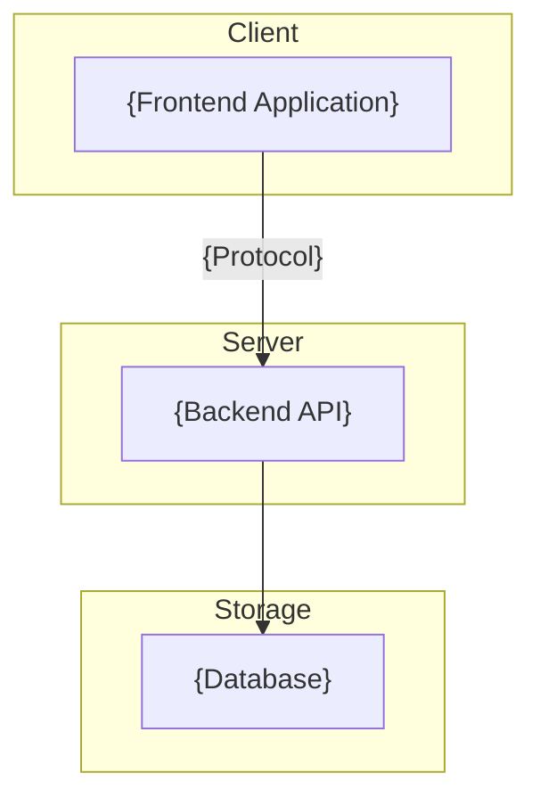
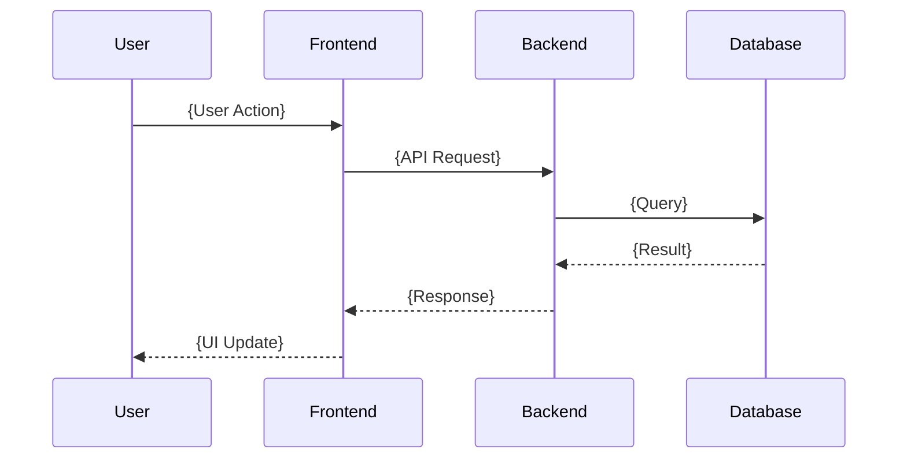
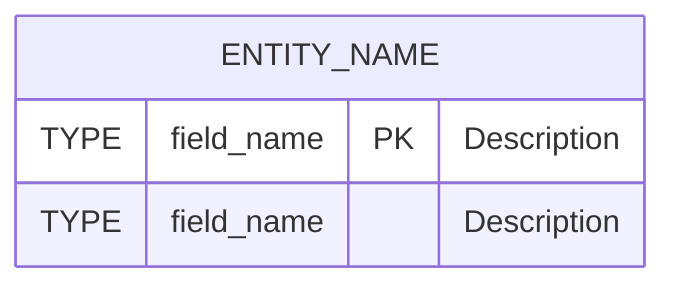
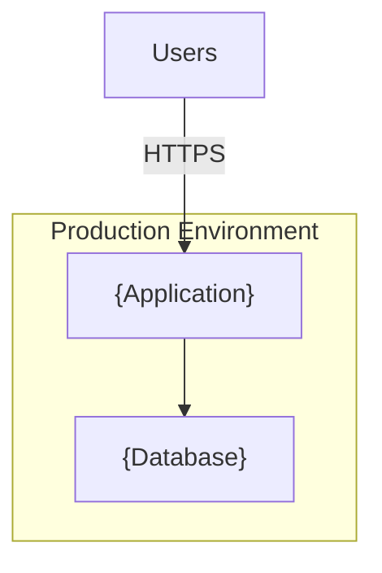

# Technical Design Document Template

> Copy this template when starting a new design document. Replace all placeholder
> text (marked with `{curly braces}`) with project-specific content.

| Field            | Value                  |
|------------------|------------------------|
| **Author**       | {Author Name}          |
| **Status**       | {Draft / Proposed / Approved / Implemented / Deprecated} |
| **Created**      | {YYYY-MM-DD}           |
| **Last Updated** | {YYYY-MM-DD}           |

---

## Table of Contents

1. [Problem Statement](#1-problem-statement)
2. [Proposed Solution](#2-proposed-solution)
3. [System Architecture](#3-system-architecture)
4. [Component Breakdown](#4-component-breakdown)
5. [API Design](#5-api-design)
6. [Data Models](#6-data-models)
7. [Security Considerations](#7-security-considerations)
8. [Performance Requirements](#8-performance-requirements)
9. [Deployment Strategy](#9-deployment-strategy)
10. [Trade-offs and Alternatives Considered](#10-trade-offs-and-alternatives-considered)
11. [Success Metrics](#11-success-metrics)

---

## 1. Problem Statement

{Describe the problem this design solves. Include:}

- What is the current situation?
- What pain points exist?
- Who is affected?
- Why does this need to be solved now?

---

## 2. Proposed Solution

{Describe the proposed solution at a high level. Include:}

- What will be built?
- What technologies will be used?
- What is the scope of the solution?

---

## 3. System Architecture

### 3.1 High-Level Architecture

{Insert a Mermaid diagram showing the major system components and their relationships.}



### 3.2 Request Flow

{Insert a sequence diagram showing a typical request through the system.}



---

## 4. Component Breakdown

### 4.1 {Layer 1 Name} Components

| Component | File | Responsibility |
|-----------|------|----------------|
| {Name} | `{path/to/file}` | {What this component does.} |

### 4.2 {Layer 2 Name} Components

| Component | File | Responsibility |
|-----------|------|----------------|
| {Name} | `{path/to/file}` | {What this component does.} |

---

## 5. API Design

### 5.1 Base URL

```
{protocol}://{host}:{port}/{base-path}
```

### 5.2 Endpoints

{For each endpoint, include method, path, parameters, request body, and response format.}

#### {Endpoint Name}

```
{METHOD} {/path}
```

| Parameter | In    | Type   | Required | Description   |
|-----------|-------|--------|----------|---------------|
| {name}    | {query/path/body} | {type} | {Yes/No} | {Description} |

**Response** `{status code}`
```json
{
  "example": "response"
}
```

---

## 6. Data Models

### 6.1 {Entity Name}

{Insert an ER diagram using Mermaid.}



### 6.2 SQL Schema

```sql
CREATE TABLE IF NOT EXISTS {table_name} (
    id INTEGER PRIMARY KEY AUTOINCREMENT,
    {column_name} {TYPE} {CONSTRAINTS}
);
```

---

## 7. Security Considerations

### 7.1 Current Measures

| Measure | Implementation | Purpose |
|---------|---------------|---------|
| {Measure name} | {How it is implemented} | {What it protects against} |

### 7.2 Recommended Enhancements

| Enhancement | Priority | Description |
|-------------|----------|-------------|
| {Enhancement name} | {High/Medium/Low} | {What it adds and why} |

---

## 8. Performance Requirements

### 8.1 Targets

| Metric | Target | Notes |
|--------|--------|-------|
| {Metric name} | {Target value} | {Additional context} |

### 8.2 Optimization Strategies

| Strategy | Status | Description |
|----------|--------|-------------|
| {Strategy name} | {Implemented/Recommended} | {How it improves performance} |

---

## 9. Deployment Strategy

### 9.1 Deployment Architecture

{Insert a Mermaid diagram showing the deployment topology.}



### 9.2 Deployment Steps

1. {Step 1}
2. {Step 2}
3. {Step 3}

### 9.3 Environment Configuration

| Variable | Default | Description |
|----------|---------|-------------|
| {VAR_NAME} | {default_value} | {What it configures} |

---

## 10. Trade-offs and Alternatives Considered

### 10.1 {Decision Area}

| Option | Pros | Cons | Decision |
|--------|------|------|----------|
| **{Chosen option}** | {Advantages} | {Disadvantages} | ✅ Chosen — {reason} |
| {Alternative 1} | {Advantages} | {Disadvantages} | {Why not chosen} |
| {Alternative 2} | {Advantages} | {Disadvantages} | {Why not chosen} |

---

## 11. Success Metrics

### 11.1 Functional Metrics

| Metric | Target | Measurement |
|--------|--------|-------------|
| {What to measure} | {Target value} | {How to measure it} |

### 11.2 Non-Functional Metrics

| Metric | Target | Measurement |
|--------|--------|-------------|
| {What to measure} | {Target value} | {How to measure it} |
